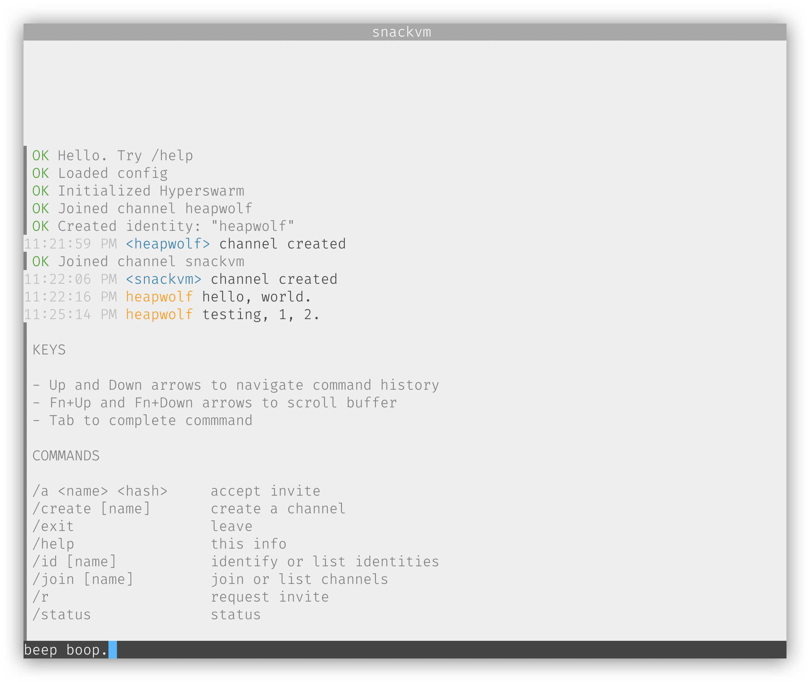

# SYNOPSIS
A terminal based client for the peerlinks protocol.



- Fully peer to peer
- Multiline input editing
- Command autocomplete
- Customizable color scheme
- Buffer scrollback
- Create channels
- Request and accept invites

# INSTALL

```sh
npm install peerchan -g
```

# GETTING STARTED

- Launch the app
- Create an identity by typing `/id <your-user-name>`.
- Make a request to join someone's channel by typing `/r` or
create your own channel by typing `/create <channel-name>`.
```

# CONFIG
Optional example config stored in `~/.peerchan.json`.

```js
{
  "bg": 255,
  "fg": 234,
  "comment": { // system comments
    "fg": 246,
    "bg": 255
  },
  "prompt": { // the text message input
    "bg": 4,
    "fg": 15
  },
  "timestamp": { // message timestamp
    "fg": 244,
    "bg": 255
  },
  "status": { // the status bar at the top
    "fg": 4,
    "bg": 15
  },
  "prefix": "▌", // prefix system comments
  "scrollback": 3, // scrollback rate
  "id": "heapwolf" // your default id
}
```

# DEBUGGING
This has been tested on node `12.16.3 LTS`, but latest, `14.1.0` seems
to have some issues.

In terminal window A...

```sh
DEBUG_COLORS=false DEBUG='peerlinks:*' INST=0 node ./bin/peerchan.js
```

In terminal widow B...
```sh
DEBUG_COLORS=false DEBUG='peerlinks:*' INST=1 node ./bin/peerchan.js
```

In terminal window C...

```sh
tail -f ./peerchan.log
```
